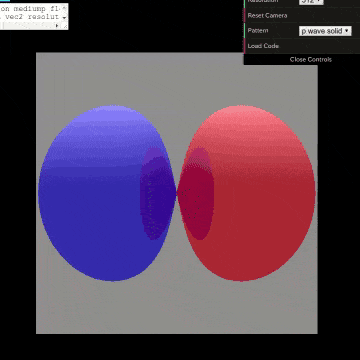
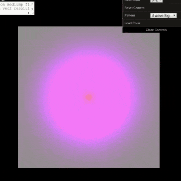

# Raymarching in 3D scalar fields

Raymarching based on the gradient of scalar function.
Spherical harmonics (pz and dzr) are rendered as demonstration.

# How to view

1. Clone this repo.
2. View `index.html`

At step 2, I usually use python:

1. Launch HTTP server as `python -m http.server`
2. Access http://localhost:8000 with a browser like Google Chrome.

# Controls

* Drag to rotate
* Mouse wheel to zoom in/out
* On the fly code modifying
   - Edit the code in the textarea on the top left area
   - Click "Load Code" button on the top right menu

# Explanation

* Qiita (in Japanese)

https://qiita.com/sage-git/items/85793dc3c274b15318bc

# Acknowledgement

Some javascript codes (script files in `js` directory) are taken from three.js project.

https://github.com/mrdoob/three.js

# Reference

The project has started with modifying these samples:

* https://threejs.org/examples/webgl_raymarching_reflect.html
* https://qiita.com/gam0022/items/03699a07e4a4b5f2d41f
